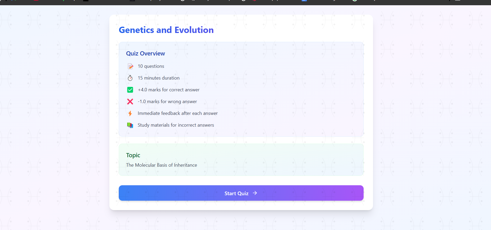
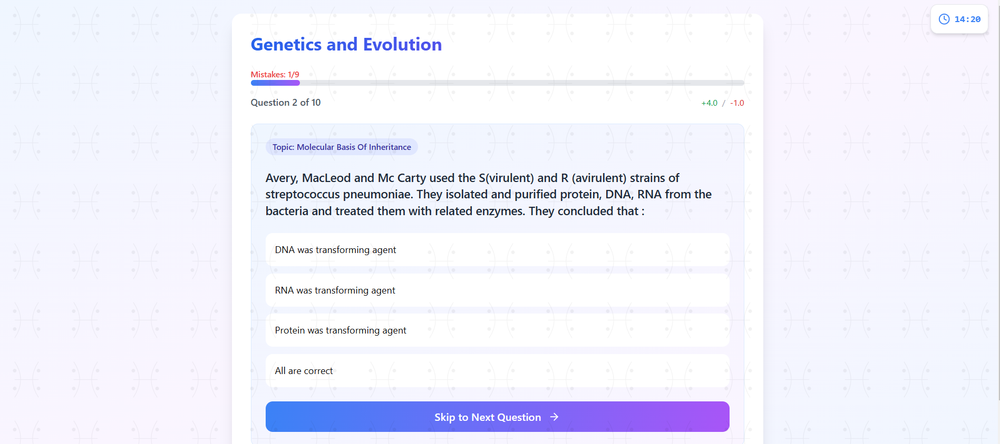
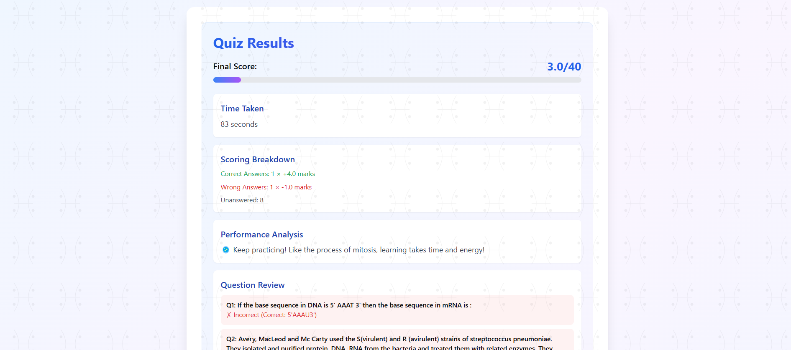
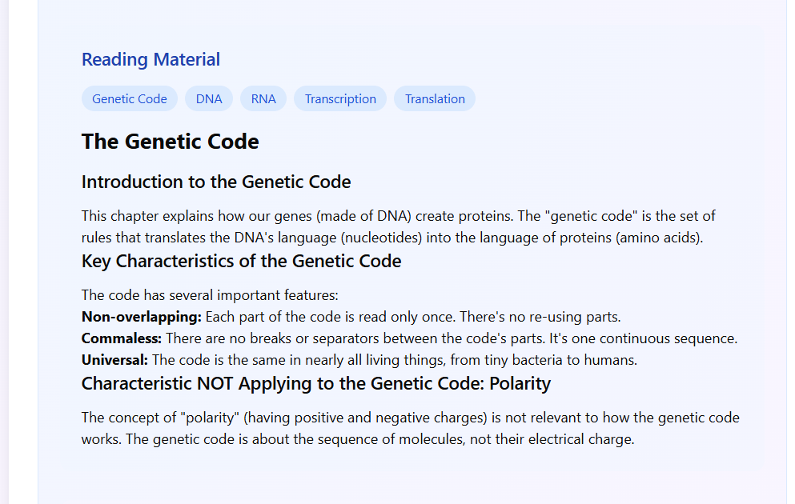

# Quiz Application

A modern, interactive quiz application built with Next.js and TypeScript.

## User Interface

### Quiz Start Screen


### Question Interface


### Answer Feedback


### Study Material


### Results Screen


## 🌟 Features

- **Interactive Quiz Interface**
  - Progress tracking
  - Immediate feedback
  - Study materials integration
  - Topic-based questions
  - Mistake counter with configurable limits

- **Question Types**
  - Mandatory and optional questions
  - Multiple choice answers
  - Detailed solutions
  - Integrated reading materials
  - Practice exercises

- **Study Materials**
  - Topic-specific reading content
  - Practice materials
  - Keyword highlighting
  - HTML-rendered content sections

## 🛠️ Technical Stack

- Next.js
- TypeScript
- Tailwind CSS
- Framer Motion
- React Markdown

## 🚀 Getting Started

1. Clone the repository:

```bash
git clone [repository-url]
```

2. Install dependencies:

```bash
npm install
```

3. Run the development server:

```bash
npm run dev
```

## 📖 Quiz Structure

Each quiz includes:
- Title and description
- Difficulty level
- Time duration
- Scoring system (positive/negative marking)
- Maximum mistake limit
- Reading materials
- Practice exercises

## 🎨 UI Components

- Progress bar
- Topic badges
- Interactive answer buttons
- Study material sections
- Mistake counter
- Navigation controls

## 🎥 Demo Video

[](https://github.com/Vansh17555555/Testline-assignment/blob/master/assets/demo.webm)


